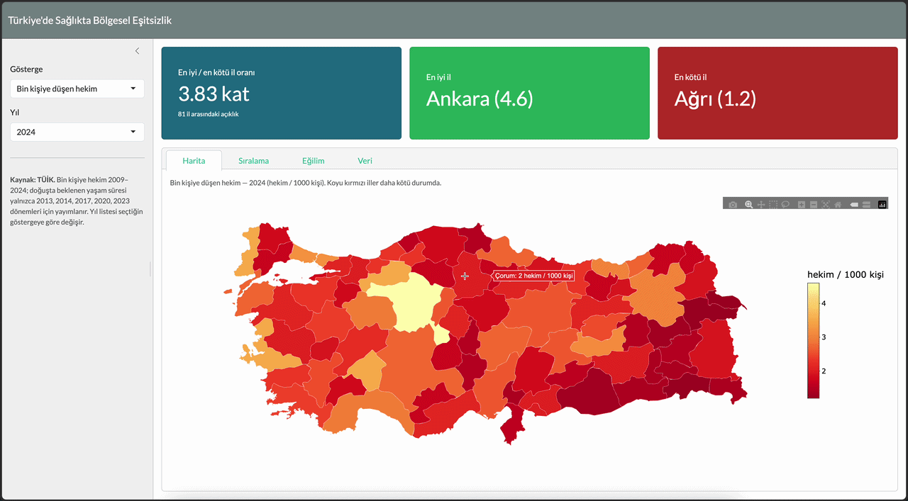

# Türkiye'de Sağlıkta Bölgesel Eşitsizlik

> **Soru:** Türkiye'nin 81 ili arasında sağlık hizmetine erişim (hekim yoğunluğu)
> ve sağlık çıktısı (doğuşta beklenen yaşam süresi) ne kadar farklılaşıyor — ve
> bu açıklık yıllar içinde kapanıyor mu?

R + Shiny ile yazılmış interaktif bir panel. İl bazlı TÜİK göstergelerini harita
üzerinde gösterir, en iyi/en kötü illeri sıralar, seçilen ilin yıllar içindeki
seyrini ülke medyanıyla karşılaştırır.

<!-- Deploy ettikten sonra: -->
<!-- **🔗 Canlı demo:** https://veysizeyrek.shinyapps.io/saglik-esitsizlik-tr/ -->

<!-- assets/demo.gif: uygulamayı çalıştırıp kısa bir ekran kaydı al. -->

---

## Bulgu

TÜİK 2009–2024 verilerine göre hekim erişiminde bölgesel açıklık büyük ve
kalıcı: **2024'te bin kişiye düşen hekim sayısı Ankara'da 4,6 iken Ağrı'da 1,2 —
yani en iyi il en kötünün yaklaşık 3,8 katı.** Bin kişiye hastane yatağında da
açıklık benzer (2024'te en yüksek Elazığ ~5,3, en düşük Şırnak ~1,3; ~4 kat).
Türkiye ortalaması yükselmesine rağmen Doğu ve Güneydoğu illeri tüm dönem boyunca
ülke ortalamasının altında kaldı. Doğuşta beklenen yaşam süresinde iller arası
açıklık daha dar (2023'te en yüksek Tunceli, en düşük Gaziantep/Kilis; ~%6–7),
ancak yine doğu–batı ekseninde sistematik.

*Not: Panel yalnızca nicel betimleme sunar; erişim ile çıktı arasında nedensellik
iddia edilmez.*

## Veri

Tümü **TÜİK Veri Portalı**'ndan il × yıl pivot olarak indirildi (`data-raw/`):

| Gösterge | Kapsam | Yıllar |
|---|---|---|
| Bin kişiye düşen hekim | 81 il | 2009–2024 (yıllık) |
| Bin kişiye düşen hastane yatağı | 81 il | 2009–2024 (yıllık) |
| Doğuşta beklenen yaşam süresi (Erkek) | 81 il | 2013, 2014, 2017, 2020, 2023 |
| Doğuşta beklenen yaşam süresi (Kadın) | 81 il | 2013, 2014, 2017, 2020, 2023 |

Bin kişiye yatak, ham yatak sayısı TÜİK il nüfusuna bölünerek hesaplandı
(`toplam yatak / nüfus × 1000`).

**Önemli ayrıntı:** Yaşam süresi yıllık değil; TÜİK 3 yıllık dönemler hâlinde
yayımlar; bu yüzden yalnızca 5 yıl mevcuttur. Panelde yıl listesi seçilen
göstergeye göre değişir — iki göstergeyi aynı "yıl" üzerinden zorla birleştirmek
yanlış olurdu.

İl sınırları (`geo/tr-iller.geojson`):
[alpers/Turkey-Maps-GeoJSON](https://github.com/alpers/Turkey-Maps-GeoJSON), Apache-2.0.

Kod: MIT. Veri: TÜİK (kamuya açık). Harita verisi: Apache-2.0 (yukarıdaki atıf).
